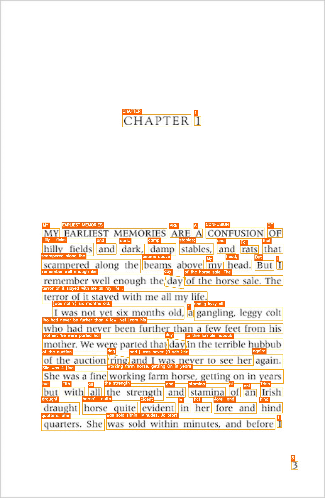
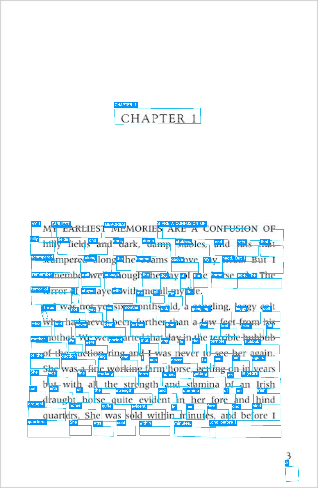
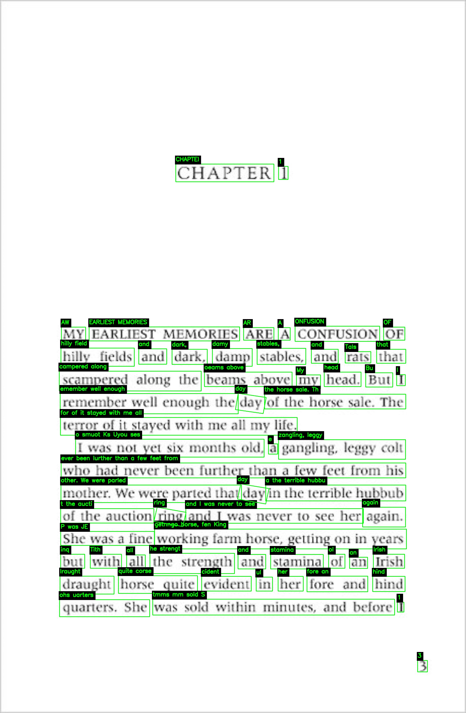

# Assortment of Small Vision ML-DL Projects


A focused collection of **Computer Vision** projects leveraging state-of-the-art models (**YOLOv8**, **YOLOv11**, **PaddleOCR**, and **EasyOCR**) for Object Tracking, Human Pose Estimation, Segmentation, and Text Recognition.

These projects demonstrate practical implementation of advanced Deep Learning vision tasks using **Ultralytics**, **OpenCV**, and specialized OCR libraries.

[](https://colab.research.google.com/drive/1BMf-DhTcPjU41TeBkBZMVRDXG0y9pDeZ#scrollTo=duGun_CTpaKz)

---
## Repository Overview
### Folders
- **`Datasets/`** – Video and image files used for processing (traffic, sports, crowds, book pages, posters).
- **`output/`** – Processed videos (`.mp4`), annotated images (`.jpg`), and demo frames generated by the scripts.

---
## 1. Real-Time Object Tracking (YOLOv8)
**File:** `YOLOv8 Car Traffic Detection.py`

Detects and tracks vehicles and pedestrians in traffic footage using multi-object tracking.

| Model | Input Source | Task |
| :--- | :--- | :--- |
| `yolov8n.pt` (Nano) | `Datasets/cartraffic03.mp4` | Multi-Object Tracking |

**Demo Output:**


**Full Video:** [Download](output/yolo_detected.mp4)

> **Key Features:**
> - Tracks 80+ COCO classes
> - Preserves original video aspect ratio
> - Lightweight Nano model for real-time performance

---
## 2. Real-Time Human Pose Estimation (YOLOv11)
**File:** `YOLO-Pose-PersonMoving.py`

Estimates human body posture by detecting 17 keypoints in dynamic sports footage.

| Model | Input Source | Task |
| :--- | :--- | :--- |
| `yolo11x-pose.pt` (XLarge) | `Datasets/personsport04.mp4` | Keypoint/Skeleton Detection |

**Demo Output:**


**Full Video:** [Download](output/yolov11_pose_estimator_detected.mp4)

> **Key Features:**
> - Custom green skeleton + red keypoints visualization
> - High accuracy using the largest YOLOv11 pose variant
> - Filters for class 0 (Person only)

---
## 3. Instance Segmentation & Crowd Analysis (YOLOv11)
**File:** `YOLOv11_Segmentation.py`

Performs pixel-level instance segmentation in dense crowd scenes.

| Model | Input Source | Task |
| :--- | :--- | :--- |
| `yolo11x-seg.pt` (XLarge) | `Datasets/crowd06.mp4` | Instance Segmentation |

**Demo Output:**


**Full Video:** [Download](output/yolov11_Segmentation.mp4)

> **Key Features:**
> - Semi-transparent masks with alpha blending (0.5)
> - Custom labels with black outlines for readability
> - Precise separation of overlapping individuals

---
## 4. Optical Character Recognition (OCR) Comparison
**Files:**
- `EasyOCR-TextRecognition.py`
- `PaddleOCR-TextRecognition.py`
- `Hybrid-TextRecognition.py`

Comparative evaluation of three OCR approaches on challenging text (book pages, posters).

| Strategy | File | Description |
| :--- | :--- | :--- |
| **EasyOCR** | `EasyOCR-TextRecognition.py` | Fast, GPU-accelerated detection with good bounding boxes; solid baseline recognition |
| **PaddleOCR** | `PaddleOCR-TextRecognition.py` | Industrial-grade accuracy, excellent with rotated/oriented text and complex fonts |
| **Hybrid** | `Hybrid-TextRecognition.py` | **Best of both:** EasyOCR for tight bounding boxes → crop → PaddleOCR for superior recognition |

**Comparative Results (Bookpage01.jpg):**

| EasyOCR Only | PaddleOCR Only | Hybrid (EasyOCR Boxes + PaddleOCR Text) |
| :---: | :---: | :---: |
|  |  |  |

> **Highlights:**
> - EasyOCR: Excellent tight boxes, orange theme visualization
> - PaddleOCR: Superior text accuracy, cyan-blue theme
> - Hybrid: Combines best detection (EasyOCR) with best recognition (PaddleOCR via cropped regions)

> **Tech Stack:**
> - EasyOCR: PyTorch-based, 80+ languages
> - PaddleOCR: PP-OCRv4/v5 lightweight models
> - Hybrid: Manual crop + predict pipeline with fallback

---
## 5. Object Tracking with Trajectory History (YOLOv11)
**File:** `YOLO-ObjectTracking.py`

This project implements robust, real-time object tracking, maintaining a trajectory (history trail) for each detected object (person). It utilizes the `YOLOv11` model for detection and tracking, and `imageio` with BGR-to-RGB conversion to ensure correct video output colors.

| Model | Input Source | Task |
| :--- | :--- | :--- |
| **`yolo11x.pt`** (Extra Large) | `Datasets/personsport03.mp4` | Multi-Object Tracking & Trajectory |

**Demo Output (GIF):**


**Full Video:** [Download](output/Yolo_Tracking.mp4)

> **Key Features:**
> * **Robust Tracking:** Includes logic to handle frames with zero detections/track IDs without crashing.
> * **Trajectory Visualization:** Draws a blue trail (path history) behind each tracked object.
> * **Optimized Output:** Uses `imageio` with BGR-to-RGB conversion to ensure correct color output in the final MP4 file.

---
## 🛠️ Getting Started

### Installation

**For YOLO Projects (Tracking, Pose, Segmentation, Trajectory):**
```bash
pip install ultralytics opencv-python numpy imageio imageio-ffmpeg

```

**For OCR Projects:**

```bash
pip install easyocr paddleocr opencv-python numpy

```

### Usage

1. Place your input files in `Datasets/`
2. Run any script: `python YOLO-ObjectTracking.py`
3. Results appear in `output/`

---

**License:** MIT
